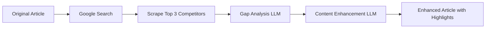

> An intelligent content enhancement system that uses AI to analyze, compare, and improve blog articles by learning from top-ranking competitors.

[](https://laravel.com)
[](https://reactjs.org)
[](https://nodejs.org)

---
## Project Overview

This platform automatically enhances blog articles using AI by:

1. **Scraping** original articles from BeyondChats blog
2. **Searching** Google for top-ranking competitor articles on the same topic
3. **Analyzing** content gaps between original and competitors
4. **Enhancing** articles with AI-generated additions (highlighted in yellow)
5. **Preserving** all original content while adding new value

###  Key Features

| Feature | Description |
|---------|-------------|
| 🔍 **Smart Gap Analysis** | AI compares your content against competitors to find missing topics |
| 📝 **Content Enhancement** | Adds new paragraphs while preserving 100% of original content |
| 🎨 **Visual Highlighting** | New AI-added content is highlighted in yellow for easy identification |
| 🔒 **XSS Protection** | All content sanitized with DOMPurify before rendering |
| 🌐 **SEO-Friendly URLs** | Clean slugs like `/articles/chatbot-benefits` |
| 💬 **Human-Like Writing** | AI writes in conversational tone to pass AI detection tools |

---

##  Architecture

```
┌─────────────────────────────────────────────────────────────────┐
│                        FRONTEND (React + Vite)                  │
│                         http://localhost:5173                   │
│  ┌─────────────┐  ┌──────────────┐  ┌────────────────────────┐  │
│  │  HomePage   │  │ ArticlePage  │  │  Components (Cards,    │  │
│  │  (List)     │  │ (Detail)     │  │  Footer, GapAnalysis)  │  │
│  └─────────────┘  └──────────────┘  └────────────────────────┘  │
└────────────────────────────┬────────────────────────────────────┘
                             │ REST API
                             ▼
┌─────────────────────────────────────────────────────────────────┐
│                    BACKEND (Laravel API)                        │
│                     http://localhost:8000                       │
│  ┌─────────────────┐  ┌──────────────────┐  ┌────────────────┐  │
│  │ ArticleController│  │ Article Model    │  │ MySQL Database │  │
│  │ (CRUD + Slug)   │  │ (Soft Deletes)   │  │ (articles,     │  │
│  └─────────────────┘  └──────────────────┘  │  competitors)  │  │
│                                             └────────────────┘  │
└─────────────────────────────────────────────────────────────────┘
                             ▲
                             │ HTTP Requests
                             │
┌─────────────────────────────────────────────────────────────────┐
│                    AI WORKER (Node.js)                          │
│  ┌────────────────┐  ┌────────────────┐  ┌────────────────────┐ │
│  │ Google Searcher │  │ Web Scraper    │  │ LLM Enhancer      │ │
│  │ (Find rivals)   │  │ (Extract text) │  │ (Llama 3 via Groq)│ │
│  └────────────────┘  └────────────────┘  └────────────────────┘ │
└─────────────────────────────────────────────────────────────────┘
```

---

## How the AI Enhancement Works



### Step-by-Step Process:

1. **Input**: Original BeyondChats article (scraped from their blog)
2. **Search**: Query Google for the article's topic, get top-ranking URLs
3. **Scrape**: Extract content from competitor articles
4. **Analyze**: LLM identifies what competitors cover that we don't
5. **Enhance**: LLM adds new paragraphs (wrapped in `<mark>` tags)
6. **Output**: Enhanced article with original content preserved + new highlighted additions

---

## Quick Start

### Prerequisites
- PHP 8.1+ & Composer
- Node.js 18+
- MySQL 8.0+

### 1. Clone & Setup

```bash
git clone https://github.com/YOUR_USERNAME/beyondchats-enhancement.git
cd beyondchats-enhancement
```

### 2. Backend (Laravel API)

```bash
cd laravel-api
cp .env.example .env
composer install
php artisan key:generate
php artisan migrate
php artisan serve
```

### 3. Frontend (React)

```bash
cd react-frontend
npm install
npm run dev
```

### 4. AI Worker (Node.js)

```bash
cd node-script
npm install
cp .env.example .env
# Add your GROQ_API_KEY to .env
npm run enhance:all
```


## 📁 Project Structure

```
Beyond Chats Assignment/
├── laravel-api/              # Backend REST API
│   ├── app/Http/Controllers/ # API endpoints
│   ├── app/Models/           # Eloquent models
│   └── database/migrations/  # DB schema
│
├── react-frontend/           # Frontend SPA
│   ├── src/pages/            # HomePage, ArticlePage
│   ├── src/components/       # Reusable UI components
│   └── src/services/         # API client
│
└── node-script/              # AI Enhancement Worker
    ├── processAll.js         # Main orchestrator
    └── services/
        ├── llmEnhancer.js    # Groq/Llama 3 integration
        ├── googleSearcher.js # Google Custom Search
        └── scraper.js        # Web content extraction
```

---

## Security Features

| Feature | Implementation |
|---------|----------------|
| **XSS Protection** | DOMPurify sanitizes all HTML before rendering |
| **Input Validation** | Laravel request validation on all API endpoints |
| **Soft Deletes** | Articles are never permanently deleted |
| **CORS** | Configured for frontend-backend communication |

---

## API Endpoints

| Method | Endpoint | Description |
|--------|----------|-------------|
| `GET` | `/api/articles` | List all articles (filter by status) |
| `GET` | `/api/articles/{slug}` | Get single article by slug |
| `POST` | `/api/articles` | Create new article |
| `PUT` | `/api/articles/{slug}` | Update article |
| `DELETE` | `/api/articles/{slug}` | Soft delete article |
| `GET` | `/api/articles/{slug}/competitors` | Get competitor analysis |

---
This is my assignment thank you
Regards

Haji Karim
